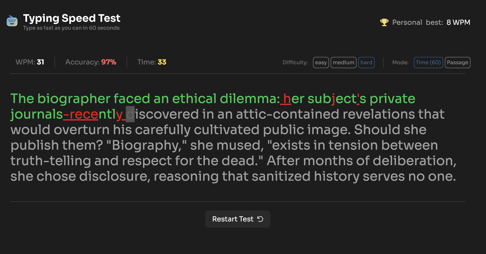

# Frontend Mentor - Typing Speed Test solution

This is a solution to the [Typing Speed Test challenge on Frontend Mentor](https://www.frontendmentor.io/challenges/typing-speed-test). Frontend Mentor challenges help you improve your coding skills by building realistic projects.

## Table of contents

- [Frontend Mentor - Typing Speed Test solution](#frontend-mentor---typing-speed-test-solution)
  - [Table of contents](#table-of-contents)
  - [Overview](#overview)
    - [The challenge](#the-challenge)
    - [Screenshot](#screenshot)
    - [Links](#links)
  - [My process](#my-process)
    - [Built with](#built-with)
    - [What I learned](#what-i-learned)
    - [Continued development](#continued-development)
    - [AI Collaboration](#ai-collaboration)
  - [Author](#author)

## Overview

### The challenge

Users should be able to:

- Start a test by clicking the start button or by clicking the passage and typing
- Select a difficulty level (Easy, Medium, Hard) for passages of varying complexity
- Switch between Timed (60s) mode and Passage mode (timer counts up, no limit)
- Restart at any time to get a new random passage
- See real-time WPM, accuracy, and time stats while typing
- See visual feedback showing correct characters (green), errors (red/underlined), and cursor position
- Correct mistakes with backspace — original errors still count against accuracy
- View results showing WPM, accuracy, and characters (correct/incorrect) after completing a test
- See a "Baseline Established!" message on their first test
- See a "High Score Smashed!" celebration with confetti when beating their personal best
- Have their personal best persist across sessions via localStorage
- View the optimal layout depending on their device's screen size
- See hover and focus states for all interactive elements

### Screenshot



### Links

- Solution URL: https://github.com/ezeed/sabaody/tree/main/ui/typing-speed-test-main
- Live Site URL: https://typing-speed-record.vercel.app/

## My process

### Built with

- Semantic HTML5 markup
- Mobile-first workflow
- Flexbox
- [React](https://reactjs.org/) - UI library
- [TypeScript](https://www.typescriptlang.org/) - Type safety
- [Vite](https://vitejs.dev/) - Build tool
- [Tailwind CSS](https://tailwindcss.com/) - Utility-first CSS

### What I learned

This challenge started as a Tailwind CSS and HTML/CSS practice — translating a design into markup. It quickly grew into a full React implementation with state management, custom hooks, and localStorage persistence. That was a surprise, but also the most valuable part.

**Custom hooks for separation of concerns**

Splitting game logic into focused hooks (`useTimer`, `useStatsSession`, `useLocalStorage`) made the component tree much cleaner. `App.tsx` acts as the orchestrator and each hook owns a single responsibility.

**Real-time WPM calculation**

WPM is recalculated on every keypress using elapsed time from the timer:

```ts
wpm: elapsedTime > 0
  ? Math.round((current - totalErrors) / 5 / (elapsedTime / 60))
  : 0,
```

The formula divides net correct characters by 5 (average word length) and normalizes to per-minute rate.

**Tracking errors with a Set**

Using a `Set<number>` to track error positions made it simple to handle backspace corrections while keeping a separate `totalErrors` counter that never decrements — matching the spec requirement that errors always count against accuracy.

### Continued development

- Deepen understanding of `useCallback` and `useMemo` dependency arrays — I used them here but want to be more confident about when they actually help vs. add noise
- Explore animation libraries for more polished transition effects
- Practice more Tailwind — ironically this project ended up being more React than CSS, so the original goal of practicing Tailwind got a bit lost

### AI Collaboration

I used [Claude Code](https://claude.ai/claude-code) throughout this project.

- **Debugging** — used it to review the finished project and catch bugs before submission. It caught an off-by-one error in the random passage selection (`getRandom` was returning 1-indexed values for a 0-indexed array) and malformed Tailwind class strings with stray quotes.
- **Code review** — asked for a full project review against the README requirements to make sure nothing was missed before submitting.
- **Concept clarification** — used it to understand tradeoffs in the code decisions rather than just getting copy-paste solutions.

## Author

- Frontend Mentor - [@ezeed](https://www.frontendmentor.io/profile/yourusername)
- LinkedIn - https://www.linkedin.com/in/ezequielcabrera
- GitHub - https://github.com/ezeed
